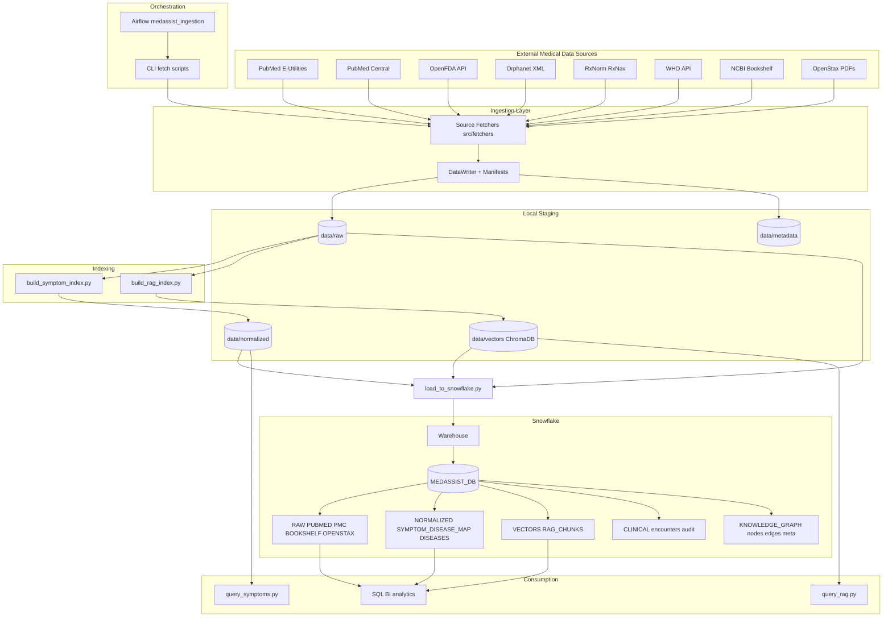
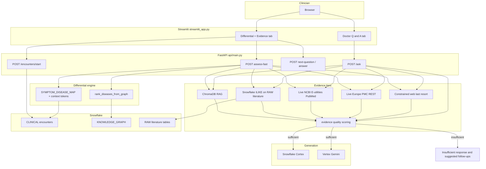

# MedAssist.AI Architecture

This document has two views:

1. **Data platform** — ingestion, local staging, Snowflake, indexing (original diagram, refined).
2. **Application runtime** — FastAPI + Streamlit doctor workspace, evidence tiers, and KG differential (current product path).

---

## 1) Data platform (Snowflake-first)

### Notes

- Snowflake setup: `scripts/snowflake_setup.sql`, loads via `scripts/load_to_snowflake.py`.
- **Clinical + KG:** `scripts/snowflake_setup_clinical_kg.sql` and `src/clinical_workflow.py` (`ensure_clinical_tables`, `seed_graph_from_symptom_map`).
- Airflow DAG currently focuses on fetch → cleanup → symptom index; see `dags/README.md` for extensions.

---

## 2) Application runtime (unified doctor workspace)

This is what runs in demo/production for clinicians: **Streamlit UI** + **FastAPI** + **Snowflake** + optional **Vertex/Cortex**.

### Flow summary

1. **Intake** creates rows in **`CLINICAL`** and links symptoms.
2. **`assess-fast`** ranks diseases via **KG first**, merges fallbacks, attaches **`evidence_summary`** / **`evidence_sources`** / **`fallback_mode`** after journal-first + live medical APIs.
3. **Follow-up** is **chat-style** in Streamlit; each **`answer`** recomputes the differential and **`next-question`** advances the dialogue (policy in `followup_policy.py`).
4. **`/ask`** uses the same evidence stack; if **`evidence_quality`** is not sufficient, the API returns **no LLM hallucination path**—only structured insufficiency + suggested questions.

---

## Repository cross-reference

| Doc | Topic |
|-----|--------|
| [README.md](README.md) | Features, env vars, quick start, API table |
| [dbt/README.md](dbt/README.md) | dbt on Snowflake |
| [dags/README.md](dags/README.md) | Airflow |
| [data/schema/README.md](data/schema/README.md) | JSON schemas |
