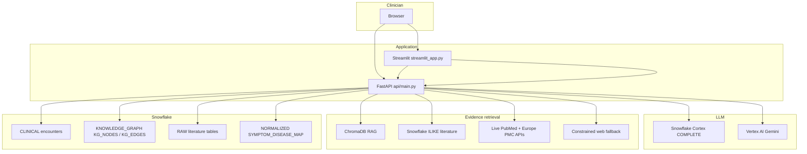
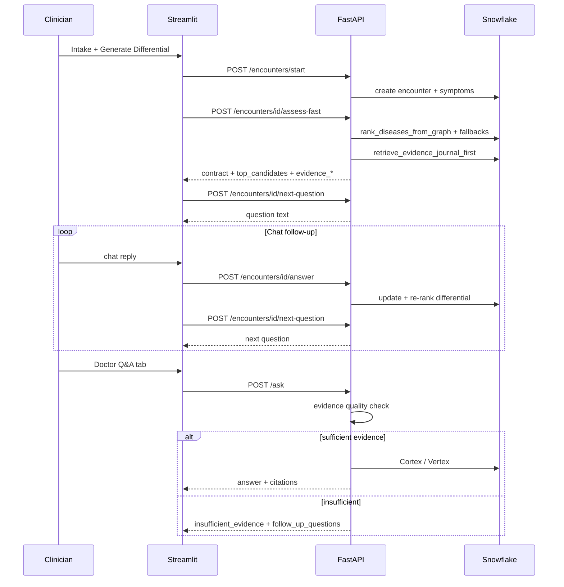

# MedAssist.AI

**MedAssist.AI** is a clinical decision-support **research and prototyping** platform. It combines open medical data, a **Snowflake-backed knowledge graph** (symptom–disease edges from Orphanet-derived maps), **semantic RAG** (ChromaDB), **literature retrieval** (PubMed, PMC, NCBI Bookshelf, OpenStax in Snowflake), **live medical APIs** (NCBI E-utilities, Europe PMC) for backup when local evidence is thin, and **LLM reasoning** via **Snowflake Cortex** and/or **Google Vertex AI (Gemini)**.

> **Important:** This software is **not** a medical device and **does not** replace professional judgment. It is for **education, research, and engineering demos**. Follow local regulations and clinical governance for any real-world use.

---

## What the unified doctor app does

The primary clinician experience is a **single Streamlit workspace** ([`streamlit_app.py`](streamlit_app.py)) backed by **FastAPI** ([`api/main.py`](api/main.py)):

| Tab | Purpose |
|-----|---------|
| **Differential + Evidence** | Patient intake → create encounter → **KG-led ranked differential** → compact clinical snapshot (summary, top diagnoses, red flags, next steps) → **journal-first evidence** with optional live PubMed/Europe PMC fallback → **chat-style follow-up** (each reply updates the differential via `/encounters/.../answer` and pulls the next question via `/encounters/.../next-question`). |
| **Doctor Q&A** | Free-form clinical questions → **RAG + Snowflake keyword retrieval** first → **evidence quality scoring** → if evidence is insufficient, returns an explicit **“insufficient evidence”** message and suggested follow-ups instead of guessing; otherwise **Cortex → Gemini** generation with citations. |

The API root **`GET /`** redirects to Streamlit (`STREAMLIT_PUBLIC_URL`, default `http://127.0.0.1:8501`).

The **doctor UI is Streamlit only** ([`streamlit_app.py`](streamlit_app.py)). There is no separate React/Vite frontend. Local demo runs the API with **`AUTH_DISABLED=1`** (see [`.env.example`](.env.example)) so the Streamlit app does not need JWT login; set **`AUTH_DISABLED=0`** and use **`/auth/login`** + Bearer tokens if you need authenticated API access.

**Run locally (API + Streamlit):**

```bash
./scripts/start_presentation.sh
```

- **Doctor UI:** `http://127.0.0.1:8501`
- **API + OpenAPI:** (port chosen automatically, often `8000`) — `/docs` on the same base URL printed by the script

**Observability:** Prometheus metrics at [`http://127.0.0.1:8000/metrics`](http://127.0.0.1:8000/metrics) (when `prometheus-fastapi-instrumentator` loads). Optional **MLflow** via `MLFLOW_TRACKING_URI` (default `file:./mlruns`); set `MLFLOW_DISABLE=1` to turn off. **Analytics:** dbt marts over `CLINICAL.ENCOUNTER_AUDIT.pipeline_metrics` — see `dbt/models/marts/`.

**Docker (API + Streamlit + Prometheus + Grafana):** `docker compose up` from the repo root (expects `.env`). Optional **Airflow** (demo): `docker compose --profile full up`.

**Evals:** `python evals/run_evals.py --base-url http://127.0.0.1:8000` (fixtures in `evals/fixtures/synthetic_cases.json`). Pytest: `pytest evals` (integration needs `RUN_EVAL_API=1` and a running API).

**Agentic assess (parallel path):** `POST /encounters/{id}/assess-agentic` — same payload shape as assess-fast plus `agent_trace` and `agent_provider` (LangGraph wrapper in `src/agentic/assessment_graph.py`).

**Follow-up self-critique (optional):** `FOLLOWUP_SELF_CRITIQUE=1` runs a short Cortex/Gemini check on the proposed next question and may substitute one alternative from the policy queue.

---

## Implemented features (summary)

### Differential & knowledge graph

- **Encounter lifecycle:** `POST /encounters/start` → `assess-fast` (default path from UI) persists differential and audit metadata; optional `assess-agentic` for LangGraph-wrapped parity experiments.
- **Ranking:** `rank_diseases_from_graph` (join encounter symptoms to `HAS_SYMPTOM` edges) with fallbacks to `SYMPTOM_DISEASE_MAP` and context-token augmentation; **KG candidates stay first** when the graph returns results.
- **Graph seeding:** `seed_graph_from_symptom_map()` keeps `KNOWLEDGE_GRAPH` aligned with `NORMALIZED.SYMPTOM_DISEASE_MAP`.
- **Response contract:** Structured `contract` JSON + markdown assessment via [`src/response_contract.py`](src/response_contract.py); safety rails in [`src/followup_policy.py`](src/followup_policy.py).

### Evidence & “internet backup” (medical-first)

- **Tier 1 — Local / warehouse:** ChromaDB semantic search + Snowflake `ILIKE` over `RAW.PUBMED_ARTICLES`, `RAW.PMC_ARTICLES`, `RAW.NCBI_BOOKSHELF`, `RAW.OPENSTAX_BOOKS`.
- **Tier 2 — Live APIs:** [NCBI E-utilities](https://www.ncbi.nlm.nih.gov/books/NBK25501/) (PubMed search + summary) and [Europe PMC REST](https://www.ebi.ac.uk/europepmc/webservices/rest) when journal evidence is still thin.
- **Tier 3 — Last resort:** constrained web HTML snippet (e.g. DuckDuckGo) biased toward `.nih.gov` / WHO-style domains.
- **Quality gate:** `_evaluate_evidence_quality` (trusted-source counts + weighted score). **`POST /ask`** refuses to fabricate when quality is insufficient and returns `insufficient_evidence` + `follow_up_questions`.

### RAG & literature Q&A

- **Hybrid retrieval** in `api/main.py`: RAG first, expand with SQL keyword search when hit count is low.
- **Orphanet symptom→disease block** appended to `/ask` context when relevant.
- **Alternate routes:** `/ask-both`, `/ask-cortex`, `/ask-gcs` (Vertex AI Search over GCS when configured).

### UI/UX (doctor workspace)

- **Streamlit-only UI** — no React/Vite client; local demo uses **`AUTH_DISABLED=1`** so there is no login screen (see [`.env.example`](.env.example) and [`streamlit_app.py`](streamlit_app.py)).
- **No fast/deep toggle** in the main flow: single deterministic **assess-fast** path for consistency.
- **Compact assessment** on screen; full markdown in an expander.
- **Follow-up chat** using `st.chat_input`; no long “full chart context” blob appended to every question (context lives in the encounter record).
- **Evidence (brief)** block with citations and `evidence_summary` / `fallback_mode` (`journal_first`, `web_assisted`, `insufficient`).

---

## High-level architecture



---

## Doctor workflow (data flow)



---

## Data sources & what gets stored

| Source | Role in repo | Typical storage |
|--------|----------------|-----------------|
| **PubMed / PMC** | Article metadata & abstracts | `data/raw`, Snowflake `RAW.PUBMED_ARTICLES`, `RAW.PMC_ARTICLES` |
| **NCBI Bookshelf / OpenStax** | Textbooks / educational content | `RAW.NCBI_BOOKSHELF`, `RAW.OPENSTAX_BOOKS` |
| **Orphanet** | Phenotypes / rare disease linkage | Feeds **symptom–disease map** and KG seeding |
| **OpenFDA, RxNorm, WHO** | Labels, Rx, WHO docs | Configured in [`config.yaml`](config.yaml); loaders in `src/fetchers/` |

Local layout:

```
data/
├── raw/           # API responses by source
├── normalized/    # e.g. symptom index JSON
├── metadata/      # Fetch manifests
├── vectors/       # ChromaDB (RAG)
└── schema/        # JSON schemas
```

Ingestion examples:

```bash
python scripts/fetch_all.py
python scripts/fetch_source.py pubmed --term "acute porphyria" --max_records 200
```

See [`config.yaml`](config.yaml) for URLs and rate limits.

---

## Knowledge graph (Snowflake)

Relational graph in **`KNOWLEDGE_GRAPH`**: `KG_NODES`, `KG_EDGES`, `KG_BUILD_META`. Edges such as **`HAS_SYMPTOM`** (disease → symptom) are seeded from **`NORMALIZED.SYMPTOM_DISEASE_MAP`**.

- DDL / reference: [`scripts/snowflake_setup_clinical_kg.sql`](scripts/snowflake_setup_clinical_kg.sql)
- Runtime helpers: [`src/clinical_workflow.py`](src/clinical_workflow.py) (`ensure_clinical_tables`, `seed_graph_from_symptom_map`, `rank_diseases_from_graph`, …)

Differentials returned to the UI include **`kg_version`** / **`kg_build_id`** where available for auditability.

---

## Technology stack

| Area | Technologies |
|------|----------------|
| **Runtime** | Python 3.10+ |
| **API** | FastAPI, Uvicorn, Pydantic |
| **UI** | Streamlit |
| **DB** | Snowflake (`snowflake-connector-python`) |
| **RAG** | `sentence-transformers`, `chromadb` |
| **LLM** | `google-genai` (Vertex), Snowflake `CORTEX.COMPLETE` |
| **HTTP** | `requests` (live PubMed / Europe PMC / fallback web) |
| **Analytics** | dbt (`dbt-snowflake`) |
| **Orchestration** | Airflow (`dags/`) |
| **Tests** | `pytest` (`tests/unit`, `tests/integration`, `tests/chaos`, …) |

---

## Repository layout (essentials)

| Path | Purpose |
|------|---------|
| [`api/main.py`](api/main.py) | FastAPI: `/ask*`, encounters, evidence retrieval, Cortex/Gemini |
| [`streamlit_app.py`](streamlit_app.py) | Unified doctor workspace (two tabs) |
| [`src/clinical_workflow.py`](src/clinical_workflow.py) | Encounters, KG ranking, differentials, idempotency |
| [`src/followup_policy.py`](src/followup_policy.py) | Next-question policy |
| [`src/response_contract.py`](src/response_contract.py) | Contract normalization + markdown |
| [`src/grounding.py`](src/grounding.py) | URL grounding checks (deep assessment path) |
| [`src/indexing/`](src/indexing/) | Symptom index + RAG helpers |
| [`src/fetchers/`](src/fetchers/) | Source ingestion clients |
| [`scripts/`](scripts/) | Fetch, indexes, Snowflake load, `start_presentation.sh`, smoke tests |
| [`dbt/`](dbt/) | Staging → marts on Snowflake |
| [`dags/`](dags/) | Airflow DAGs |
| [`static/`](static/) | Legacy static assets (not served as primary UI; root redirects to Streamlit) |

---

## Prerequisites

- **Python 3.10+**, Git, network access for APIs.
- **NCBI:** `EMAIL` in environment; optional `NCBI_API_KEY` for higher rate limits.
- **Vertex AI / Gemini:** GCP project, Vertex AI enabled, [ADC](https://cloud.google.com/docs/authentication/provide-credentials-adc). **Replace** hardcoded `project` / `location` / `MODEL_ID` in [`api/main.py`](api/main.py) for your deployment.
- **Snowflake:** `SNOWFLAKE_*` variables (see table below).
- **OpenFDA:** optional `OPENFDA_API_KEY`.

---

## Environment variables

| Variable | Purpose |
|----------|---------|
| `EMAIL`, `NCBI_API_KEY` | NCBI E-utilities |
| `OPENFDA_API_KEY` | OpenFDA (optional) |
| `SNOWFLAKE_ACCOUNT`, `SNOWFLAKE_USER`, `SNOWFLAKE_PASSWORD` | Snowflake auth |
| `SNOWFLAKE_ROLE`, `SNOWFLAKE_WAREHOUSE`, `SNOWFLAKE_DATABASE`, `SNOWFLAKE_SCHEMA` | Defaults |
| `SNOWFLAKE_AUTHENTICATOR` | Optional SSO / external browser |
| `AUTH_DISABLED` | `1` = API accepts requests without `Authorization: Bearer` (default in `./scripts/start_presentation.sh` and `docker compose` for Streamlit-first local use). `0` = JWT required. |
| `JWT_SECRET`, `JWT_EXPIRE_MINUTES` | Signed tokens when auth is enabled (`api/auth.py`) |
| `MEDASSIST_STREAMLIT_ROLE` | `doctor` or `admin` — controls optional **Admin · Quality** tab in Streamlit (UI only; API role still comes from JWT or `AUTH_DISABLED_ROLE`) |
| `STREAMLIT_PUBLIC_URL` | Where `/` redirects (default `http://127.0.0.1:8501`) |
| `MEDASSIST_API_BASE` | Base URL Streamlit and scripts use to call the API |
| `CORS_ORIGINS` | Comma-separated browser origins allowed by the API (default includes Streamlit on port **8501**) |
| `VERTEX_AI_DATASTORE_PATH` or `VERTEX_AI_DATASTORE_ID` | `/ask-gcs` grounding |
| `CLINICAL_USE_CORTEX` | `1` makes `initial-assessment` wrapper prefer deep path |
| `CLINICAL_MAX_TURNS` | Max follow-up turns |

Create a **`.env`** in the project root (see [`.env.example`](.env.example)).

---

## Quick start

```bash
cd MedAssist.AI
./setup_venv.sh    # or: python3 -m venv venv && source venv/bin/activate && pip install -r requirements.txt
./scripts/start_presentation.sh
```

Smoke test:

```bash
MEDASSIST_API_BASE=http://127.0.0.1:8000 ./scripts/smoke_presentation.sh
```

---

## API surface (current)

| Method | Path | Purpose |
|--------|------|---------|
| GET | `/` | Redirect to Streamlit |
| POST | `/ask` | Literature + Orphanet context; evidence quality gate; Cortex → Gemini |
| POST | `/ask-both`, `/ask-cortex`, `/ask-gcs` | Alternate providers / GCS datastore |
| POST | `/encounters/start` | Create encounter |
| POST | `/encounters/{id}/assess-fast` | KG-led assessment + evidence fields |
| POST | `/encounters/{id}/assess-deep` | Cortex narrative + grounding checks + fallbacks |
| POST | `/encounters/{id}/initial-assessment` | Wrapper: deep if `CLINICAL_USE_CORTEX=1`, else fast |
| POST | `/encounters/{id}/next-question`, `/answer` | Follow-up loop |
| GET | `/encounters/{id}/context`, `/kg-preview` | Context and KG edge preview |

Open **`/docs`** for the live OpenAPI schema.

---

## Symptom index & RAG (CLI)

```bash
python scripts/build_symptom_index.py
python scripts/query_symptoms.py "fever" "vomiting"
python scripts/build_rag_index.py
python scripts/query_rag.py "fever and vomiting differential"
```

---

## Snowflake, dbt, Airflow

- Load and DDL: `scripts/run_snowflake_setup.py`, `scripts/load_to_snowflake.py`, [`scripts/snowflake_setup_clinical_kg.sql`](scripts/snowflake_setup_clinical_kg.sql)
- **dbt:** [`dbt/README.md`](dbt/README.md)
- **Airflow:** [`dags/README.md`](dags/README.md)

---

## Testing

```bash
source venv/bin/activate
python3 -m pytest -q tests
```

See also [`scripts/pre_release_check.sh`](scripts/pre_release_check.sh).

---

## Deployment notes

- Run API: `uvicorn api.main:app --host 0.0.0.0 --port 8000` (or behind a process manager).
- Set **`STREAMLIT_PUBLIC_URL`** to your **public Streamlit URL** so `/` redirects correctly.
- Run Streamlit separately or via the same host. Server-side `requests` from Streamlit to the API do not use browser CORS; set **`CORS_ORIGINS`** if you add other browser clients.
- For production, prefer **`AUTH_DISABLED=0`**, issue JWTs via **`POST /auth/login`**, and pass **`Authorization: Bearer …`** from clients that support it (the stock Streamlit app is oriented toward **`AUTH_DISABLED=1`** for demos).
- Inject Snowflake and GCP secrets via your platform’s secret manager.
- Populate **`NORMALIZED.SYMPTOM_DISEASE_MAP`** and seed **`KNOWLEDGE_GRAPH`** before relying on KG differentials in production.

---

## Further reading

- [`ARCHITECTURE.md`](ARCHITECTURE.md) — ingestion + Snowflake platform diagram (updated with app layer)
- [`dbt/README.md`](dbt/README.md), [`dags/README.md`](dags/README.md), [`data/schema/README.md`](data/schema/README.md)

---

## License and attribution

Respect each upstream provider’s terms (NCBI, FDA, Orphanet, RxNorm, WHO, OpenStax, Europe PMC, etc.). Do not republish raw downloads where the license forbids it.
