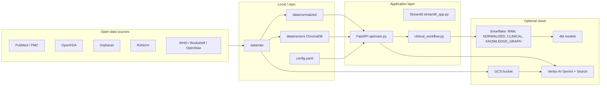

# MedAssist.AI

**MedAssist.AI** is a research and prototyping platform for a **clinical decision-support assistant**: it combines open medical data, a rare-disease–oriented symptom index, optional semantic retrieval (RAG), and **Google Vertex AI (Gemini)** with optional grounding in **Snowflake** (clinical encounters, knowledge graph) and **Vertex AI Search** over data in **GCS**.

> **Important:** This software is **not** a medical device and **does not** provide diagnosis or treatment. It is intended for **education, research, and engineering demos** only. Always follow local regulations and clinical governance for any real-world use.

---

## Why this project exists

Clinicians and researchers often need to **narrow differentials**, surface **rare diseases** that match a phenotype, and **ground** suggestions in **literature and structured data**—without wiring dozens of APIs by hand. MedAssist.AI provides:

1. **Data ingestion** from major **free** APIs and datasets (PubMed, PMC, OpenFDA, Orphanet, RxNorm, WHO, NCBI Bookshelf, OpenStax).
2. **Normalization and indexes** (symptom → disease maps from Orphanet; optional ChromaDB RAG over chunked text).
3. **A FastAPI backend** with encounter-based flows, structured response contracts, grounding checks, and follow-up questioning policy.
4. **Interfaces**: a static web UI under `/`, an optional **Streamlit** prototype, and scripts for batch testing and evaluation.
5. **Optional cloud path**: load or mirror data to **Snowflake**, transform with **dbt**, orchestrate with **Airflow**, optionally use **GCS + Vertex AI Search**, and maintain a **disease–symptom knowledge graph** in Snowflake for structured ranking and auditability.

---

## High-level architecture



---

## Technology stack

| Area | Technologies |
|------|----------------|
| **Language** | Python 3 |
| **HTTP / APIs** | `requests`, FastAPI, Uvicorn |
| **Config** | `config.yaml`, `python-dotenv`, PyYAML |
| **Resilience** | `tenacity` (retries) |
| **Parsing** | `lxml` (XML), PyMuPDF (OpenStax PDFs) |
| **Embeddings & RAG** | `sentence-transformers` (e.g. `all-MiniLM-L6-v2`), `chromadb` |
| **LLM** | `google-genai` → **Vertex AI** (Gemini); uses Application Default Credentials |
| **Warehouse** | Snowflake (`snowflake-connector-python`) |
| **Knowledge graph** | Snowflake schema **`KNOWLEDGE_GRAPH`**: `KG_NODES`, `KG_EDGES`, `KG_BUILD_META` (disease ↔ symptom edges seeded from `NORMALIZED.SYMPTOM_DISEASE_MAP`) |
| **Analytics** | **dbt** with `dbt-snowflake` |
| **Orchestration** | **Apache Airflow** (DAGs in `dags/`) |
| **GCP** | `google-cloud-storage`, `google-auth`; `gsutil` for bulk upload |
| **UI** | Static site in `static/`, Streamlit |
| **Testing** | `pytest` (`tests/unit`, `tests/integration`, `tests/scenario`, `tests/chaos`) |

---

## Repository layout

| Path | Purpose |
|------|---------|
| `api/main.py` | FastAPI app: `/ask*`, encounter endpoints, static UI, optional Cortex / GCS-grounded routes |
| `src/clinical_workflow.py` | Encounters, differentials, idempotency, Snowflake CLINICAL / KNOWLEDGE_GRAPH helpers |
| `src/followup_policy.py`, `src/grounding.py`, `src/response_contract.py` | Question flow, grounding validation, structured answer shape |
| `src/fetchers/` | Source-specific ingestion clients |
| `src/indexing/` | Symptom index and RAG index helpers |
| `src/snowflake_client.py` | Snowflake connection from environment variables |
| `scripts/` | CLI: fetch, build indexes, load Snowflake, upload GCS, smoke tests, eval |
| `scripts/snowflake_setup_clinical_kg.sql` | DDL for **`CLINICAL`** encounter tables and **`KNOWLEDGE_GRAPH`** node/edge tables (can be run in Worksheets or folded into your migration process) |
| `dbt/` | Staging → intermediate → mart models on Snowflake |
| `dags/` | Airflow DAGs for automated ingestion and downstream steps |
| `data/raw`, `data/normalized`, `data/vectors` | Local data and ChromaDB store (gitignored at runtime) |
| `config.yaml` | Source URLs, rate limits, paths |
| `streamlit_app.py` | Optional doctor-side Streamlit UI |
| `static/` | Production-style static frontend served at `/` |

---

## Prerequisites

- **Python 3.10+** (recommended; match your team standard).
- **Git** and network access for public APIs.
- For **NCBI** (PubMed, PMC, Bookshelf): an **`EMAIL`** in the environment (required by NCBI); optional **`NCBI_API_KEY`** for higher throughput.
- For **OpenFDA**: optional **`OPENFDA_API_KEY`** (otherwise public limits apply).
- For **Vertex AI / Gemini** (API features): **Google Cloud project**, **Vertex AI API enabled**, and [Application Default Credentials](https://cloud.google.com/docs/authentication/provide-credentials-adc) (e.g. `gcloud auth application-default login` for local dev). The sample code pins a demo `project`/`location` in `api/main.py`—**change these** for your own deployment.
- For **Snowflake**: account, user, password (or SSO strategy supported by the connector), role, warehouse, database.
- For **Airflow**: separate venv as described in `dags/README.md`.
- For **GCS upload**: Google Cloud SDK (`gsutil`) and bucket permissions.

---

## Quick start (local)

### 1. Clone and create a virtual environment

```bash
git clone <your-fork-or-remote> MedAssist.AI
cd MedAssist.AI
./setup_venv.sh
source venv/bin/activate
```

Or manually: `python3 -m venv venv && source venv/bin/activate && pip install -r requirements.txt`

### 2. Environment variables

Create a `.env` file in the project root (loaded automatically via `python-dotenv` in `src/config.py`). Common variables:

| Variable | Used for |
|----------|-----------|
| `EMAIL` | NCBI E-utilities (PubMed, PMC, Bookshelf) |
| `NCBI_API_KEY` | Optional; higher NCBI rate limits |
| `OPENFDA_API_KEY` | Optional OpenFDA key |
| `SNOWFLAKE_ACCOUNT`, `SNOWFLAKE_USER`, `SNOWFLAKE_PASSWORD` | Snowflake |
| `SNOWFLAKE_ROLE`, `SNOWFLAKE_WAREHOUSE`, `SNOWFLAKE_DATABASE`, `SNOWFLAKE_SCHEMA` | Snowflake defaults (see `src/snowflake_client.py`) |
| `SNOWFLAKE_AUTHENTICATOR` | Optional; e.g. externalbrowser / SSO |
| `VERTEX_AI_DATASTORE_PATH` or `VERTEX_AI_DATASTORE_ID` | Vertex AI Search grounding (`/ask-gcs` path) |
| `CLINICAL_USE_CORTEX` | Set to `1` to prefer Snowflake Cortex paths where implemented |
| `CLINICAL_MAX_TURNS` | Cap on follow-up turns in the clinical flow |
| `MEDASSIST_API_BASE` | Base URL for scripts that call the API (e.g. `http://127.0.0.1:8000`) |

### 3. Run the API and web UI

From the project root (with `venv` active):

```bash
./scripts/start_presentation.sh
```

Or explicitly:

```bash
uvicorn api.main:app --host 127.0.0.1 --port 8000
```

- **API docs:** `http://127.0.0.1:8000/docs`
- **Static UI:** `http://127.0.0.1:8000/` (requires `static/index.html`)

Smoke the deployment:

```bash
MEDASSIST_API_BASE=http://127.0.0.1:8000 ./scripts/smoke_presentation.sh
```

### 4. Optional: Streamlit

```bash
source venv/bin/activate
streamlit run streamlit_app.py
```

Configure the sidebar to point at your FastAPI `POST /ask` URL if you want LLM-backed answers from the API.

---

## Data ingestion

**Batch fetch (small sample):**

```bash
python scripts/fetch_all.py
```

**Larger runs with checkpoint/resume:**

```bash
python scripts/fetch_all_checkpointed.py --reset
# If interrupted, rerun without --reset to resume
python scripts/fetch_all_checkpointed.py
python scripts/cleanup_duplicate_raw.py
```

**Single-source examples:**

```bash
python scripts/fetch_source.py pubmed --term "acute porphyria" --max_records 200
python scripts/fetch_source.py openfda --endpoint label --max_records 1000
python scripts/fetch_source.py orphanet --dataset phenotypes
python scripts/fetch_source.py rxnorm --query "ibuprofen"
python scripts/fetch_source.py pmc --term "rare disease" --max_records 500
python scripts/fetch_source.py who --endpoint documents --limit 50
python scripts/fetch_source.py ncbi_bookshelf --term "pharmacology" --max_records 100
python scripts/fetch_source.py openstax --book pharmacology
```

Sources and limits are defined in `config.yaml`.

**Data directories:**

```
data/
├── raw/           # API responses by source
├── normalized/    # Symptom index JSON, etc.
├── metadata/      # Fetch manifests
├── vectors/       # ChromaDB persistence (RAG)
└── schema/        # JSON schemas
```

---

## Symptom index and RAG

**Symptom → rare disease (Orphanet-derived):**

```bash
python scripts/build_symptom_index.py
python scripts/query_symptoms.py "fever" "vomiting"
python scripts/query_symptoms.py "nausea" "headache" --any
```

**Semantic RAG (ChromaDB + MiniLM):**

```bash
python scripts/build_rag_index.py
python scripts/build_rag_index.py --max-chunks 20000
python scripts/query_rag.py "fever and vomiting differential diagnosis"
```

---

## Snowflake and dbt

**Create objects and load from local files** (see `scripts/snowflake_setup.sql` and Python helpers):

```bash
python scripts/run_snowflake_setup.py
python scripts/load_to_snowflake.py --all
# Or selective: python scripts/load_to_snowflake.py --symptoms --pubmed
```

**dbt** transforms raw Snowflake tables into staging, intermediate, and mart models. See **`dbt/README.md`** for `dbt debug`, `dbt run`, and required roles/schemas.

---

## Knowledge graph (Snowflake)

The **knowledge graph** is a **relational, property-graph–style** model stored in Snowflake (not a separate graph database). It supports **explainable disease candidates** for encounters by linking **diseases** and **symptoms** with typed edges, and it ties every differential back to a **versioned build** for reproducibility.

### What it models

| Object | Table | Role |
|--------|--------|------|
| **Nodes** | `KNOWLEDGE_GRAPH.KG_NODES` | Entities such as **`DISEASE`** (Orphanet-backed labels + `orpha_code` in `attributes`) and **`SYMPTOM`** (normalized symptom text). `node_type` is extensible for future node kinds (e.g. demographics, comorbidities). |
| **Edges** | `KNOWLEDGE_GRAPH.KG_EDGES` | Relationships such as **`HAS_SYMPTOM`**: directed **disease → symptom**, with optional `weight` / `attributes` (e.g. frequency metadata from the map). |
| **Build metadata** | `KNOWLEDGE_GRAPH.KG_BUILD_META` | **`kg_version`** and **`build_id`** (e.g. `v1` / `seed_symptom_map`), plus `source_snapshot_ts` and notes so APIs and audits know **which graph snapshot** produced a ranking. |

The SQL file **`scripts/snowflake_setup_clinical_kg.sql`** creates the **`CLINICAL`** and **`KNOWLEDGE_GRAPH`** schemas and includes the same **INSERT** logic used to populate nodes and edges from **`NORMALIZED.SYMPTOM_DISEASE_MAP`**. In Python, **`ensure_clinical_tables()`** in `src/clinical_workflow.py` creates compatible tables if missing, and **`seed_graph_from_symptom_map()`** idempotently merges rows from that normalized table into `KG_NODES` / `KG_EDGES`.

### How data flows into the graph

1. **Ingest** Orphanet (and related) data → build local / warehouse **`NORMALIZED.SYMPTOM_DISEASE_MAP`** (via `scripts/load_to_snowflake.py` and your pipeline).
2. **Seed** the graph: run the setup SQL **or** call **`seed_graph_from_symptom_map()`** (also invoked from encounter startup paths in `api/main.py` so the graph stays aligned with the map).
3. **Query** at encounter time: **`rank_diseases_from_graph(encounter_id)`** joins `CLINICAL.ENCOUNTER_SYMPTOMS` to **`HAS_SYMPTOM`** edges and scores diseases by **matched symptom count** and **coverage** (see `src/clinical_workflow.py`). If the KG is unavailable, the API can fall back to **`rank_diseases_from_symptom_map`**, which queries `NORMALIZED.SYMPTOM_DISEASE_MAP` directly with pattern overlap.

### How it surfaces in the product

- Saved differentials and audit rows include **`kg_version`** and **`kg_build_id`** so you can trace outputs to a graph build.
- **`get_latest_kg_build_meta()`** reads `KG_BUILD_META` for the newest build and defaults safely if the table is empty.
- The optional commented block at the end of **`scripts/snowflake_setup_clinical_kg.sql`** shows how you could attach Snowflake **native GRAPH** objects to the same `KG_NODES` / `KG_EDGES` tables if your account supports them.

---

## Airflow orchestration

The **`medassist_ingestion`** DAG chains fetch cleanup, symptom index, optional RAG build, and optional Snowflake load. Setup and variables are documented in **`dags/README.md`**.

```bash
./setup_venv.sh
# Install Airflow in venv_airflow per dags/README.md, then:
./start_airflow.sh
```

---

## API surface (overview)

Key routes in `api/main.py` include:

| Method | Path | Purpose |
|--------|------|---------|
| GET | `/` | Static UI |
| POST | `/ask` | General Q&A-style query |
| POST | `/ask-both`, `/ask-cortex`, `/ask-gcs` | Alternate retrieval / grounding paths |
| POST | `/encounters/start` | Start a patient encounter |
| POST | `/encounters/{id}/assess-fast`, `.../assess-deep`, `.../initial-assessment` | Assessment flows |
| POST | `/encounters/{id}/next-question`, `.../answer` | Guided follow-up |
| GET | `/encounters/{id}/context` | Encounter context |

Use **`/docs`** for the live OpenAPI schema.

---

## Testing and quality gates

```bash
source venv/bin/activate
pip install pytest   # if not already present
python3 -m pytest -q tests
```

The repository also includes **`scripts/pre_release_check.sh`** (syntax compile + pytest + manual checklist echo).

---

## Deployment guide

There is no single “official” cloud manifest in-repo; deployments typically combine the pieces below.

### 1. Application service (FastAPI)

- **Run:** `uvicorn api.main:app --host 0.0.0.0 --port 8000` (or behind Gunicorn/Uvicorn workers as you prefer).
- **Ship:** container image or VM with `requirements.txt` installed, `static/` bundled, and secrets injected as env vars.
- **Update:** Point `api/main.py` Vertex `project` / `location` / `MODEL_ID` at **your** GCP project and approved models.

### 2. Google Vertex AI (Gemini)

- Enable **Vertex AI API** on the project.
- Grant the runtime identity **Vertex AI User** (and any Search/GCS roles if using those features).
- Use **Workload Identity** (GKE), **service account key** (only if unavoidable), or **ADC** on developer machines.

### 3. Snowflake (including knowledge graph)

- Store credentials in a **secret manager**; inject `SNOWFLAKE_*` at runtime.
- Run DDL from `scripts/` in a controlled migration process—especially **`scripts/snowflake_setup_clinical_kg.sql`** (or equivalent) so **`CLINICAL`** and **`KNOWLEDGE_GRAPH`** exist before serving encounter APIs.
- After loads, ensure **`NORMALIZED.SYMPTOM_DISEASE_MAP`** is populated, then **seed** `KG_NODES` / `KG_EDGES` (SQL file or `seed_graph_from_symptom_map()`).
- Use **dbt** in CI or a job orchestrator against the same database.

### 4. Data in GCS + Vertex AI Search (optional)

- Upload curated artifacts: `python scripts/upload_to_gcp.py` (see script docstring for bucket paths).
- Configure `VERTEX_AI_DATASTORE_PATH` or `VERTEX_AI_DATASTORE_ID` for grounded `/ask-gcs`-style flows.

### 5. Airflow

- Run Airflow in its own environment; set **`medassist_project_root`** (and optional flags) per **`dags/README.md`**.

### 6. Streamlit

- Deploy separately (e.g. Streamlit Community Cloud, Cloud Run) if you still use the prototype; point it at the public FastAPI base URL.

---

## Contributing and support

- Match existing **code style** and **keep changes scoped** to the feature you are adding.
- Run **`pytest`** and relevant scripts before opening a PR.
- For deeper component docs, see **`dbt/README.md`**, **`dags/README.md`**, and **`data/schema/README.md`**.

---

## License and attribution

Respect the **terms of use** of each upstream API and dataset (NCBI, FDA, Orphanet, RxNorm, WHO, OpenStax, etc.). This project aggregates public interfaces; **redistribution of raw downloads** may be restricted by the source—check each provider’s policy before republishing data.
